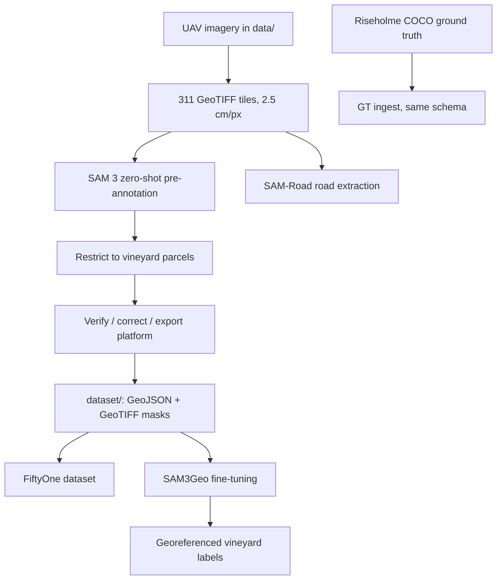

# GeoTech-Sigmoid

Hackathon project: segmentation of UAV (drone) vineyard imagery. The goal is a
model, **SAM3Geo**, that turns centimetre-scale orthomosaic tiles into georeferenced
vector annotations: grapevine canopies, vine rows, inter-row areas, weeds/small
plants, trees and litter (plastic/trash).

## Overview

The project runs in three layers:

1. **Auto-label.** SAM 3 segments the tiles zero-shot from text prompts and writes
   candidate labels.
2. **Human verify / correct / export.** A self-hosted web platform where the team
   reviews each tile, fixes the labels and exports them as CVAT XML and GeoTIFF masks.
3. **Dataset + training.** Verified labels become the published dataset
   ([`dataset/`](dataset/)), which is indexed in FiftyOne and used to fine-tune SAM3Geo.

**Imagery.** The main target is the Sireț3 challenge field: 311 GeoTIFF tiles,
2048 × 2048 px at **2.5 cm/px**, EPSG:32635.

**Label taxonomy and size priors.** These follow the challenge annotation rules:

| Class | Geometry | Size prior |
|---|---|---|
| `vineyard` | Polygon around the canopy of one grapevine (one canopy = one plant) | ~0.2–2.5 m²; trees (2–4 m crowns) are rejected by an upper size cap |
| `row` | Polyline along a vine row | n/a |
| `interrow_area` | Polygon between rows | n/a |
| `waste` | Tight box around a piece of litter | ~0.02–4 m² |
| `dead_vine` | Polygon | n/a |

Weeds and leaf clumps under ~0.2 m² that are not plants are not annotated. At
2.5 cm/px these priors become fixed pixel-area filters.

## Pipeline



| # | Stage | What it does | Where |
|---|---|---|---|
| 1 | SAM 3 pre-annotation | Text-prompted SAM 3 over 2048 px tiles at native GSD. Detections are de-duplicated across crop overlaps with polygon NMS. Writes per-tile GeoJSON, a quick-look PNG and an ExG + Otsu colour baseline. Resumable. | `sam3_poc.py` (in progress: `feat/marcaj-auto-label`). Output on main: [`dataset/v10/`](dataset/v10/) |
| 2 | Riseholme ground truth | Converts Riseholme COCO annotations into the same per-image GeoJSON schema as stage 1, so predictions and GT can be compared. Only the summer (July/August) captures are used. A preview renderer draws the COCO polygons for visual QA. | `riseholme_ingest.py`, `scripts/render_coco_previews.py` (in progress: `feat/marcaj-auto-label`) |
| 3 | Parcel restriction | Labels are kept only inside the SAM 3 vineyard parcel outlines. Renders colour the canopy borders. | [`dataset/v10/parcels_v2.geojson`](dataset/v10/parcels_v2.geojson), [`backend/app/parcels.py`](backend/app/parcels.py) |
| 4 | Verify / correct / export | FastAPI backend with a React + Vite + Leaflet frontend. Tile status (unchecked / in progress / verified), polygon editing, CVAT import/export and GeoTIFF mask export. | [`backend/`](backend/), [`frontend/`](frontend/), [`scripts/run-backend.sh`](scripts/run-backend.sh), [`scripts/run-frontend.sh`](scripts/run-frontend.sh) |
| 5 | Published dataset | Team-corrected labels: `<tile>__labels.geojson` plus `<tile>_mask.tif` for each tile, a per-tile manifest and a labelled field mosaic. | [`dataset/`](dataset/) (see [`dataset/README.md`](dataset/README.md)) |
| 6 | FiftyOne dataset | Indexes every image under `data/<dataset>/` into a persistent FiftyOne dataset. Multispectral TIFFs get RGB previews. | [`scripts/build_fiftyone.py`](scripts/build_fiftyone.py) |
| 7 | SAM3Geo fine-tuning | See below. | in progress: `feat/finetune-sam` |
| – | SAM-Road (related) | Extracts the field's road network with pretrained SAM-Road. Produces per-tile masks, GeoJSON and previews. | `road_extraction/` (in progress: `feat/sam-road-extraction`) |

### SAM3Geo fine-tuning

The target is a model of about **92M parameters**, the size of a ViT-B image encoder
(SAM's ViT-B encoder has about 91M). That is large enough to learn vine-row, weed and
litter texture at 2.5 cm/px and small enough to train and serve on a single GPU. The
design, being built on `feat/finetune-sam`:

- SAM 3 is turned into a semantic segmenter using the finetune-SAM recipe: an empty
  prompt, one mask token per class, and every weight trainable.
- Training uses the team labels in `dataset/`, rasterised to per-class targets
  (canopy, plant edge, row, inter-row, waste, dead vine). The splits are spatially
  separate, and the organiser ground-truth tiles are held out as the test set.
- Inference uses sliding windows over each 2048 px tile. The predictions are then
  vectorised back to the team GeoJSON schema, limited to the vineyard parcels, with a
  watershed step that splits touching plants apart.

The exact architecture and parameter budget are not final yet. The fine-tuning code is
not committed yet, so there are no commands for it in this README.

## Setup

Requires Python 3.11 and Node 18 (for the frontend). The SAM 3, fine-tuning and
SAM-Road stages need a CUDA GPU. The dataset tools and the labeling platform run on CPU.

```bash
python -m venv .venv && source .venv/bin/activate
pip install -r requirements.txt           # FiftyOne dataset tools + tif_preview
```

- **Labeling platform:** see [RUN.md](RUN.md), the full operator guide (run scripts,
  environment variables, first-run data import). In short:

  ```bash
  cd frontend && npm install && VITE_API_BASE= npm run build   # build the UI once
  PORT=8010 ./scripts/run-backend.sh                         # API + UI on one port
  ```

  The backend serves `/api` and the built UI from one origin and binds `0.0.0.0`, so
  peers on the Headscale mesh can reach it.

- **FiftyOne dataset:**

  ```bash
  python scripts/build_fiftyone.py --dry-run            # scan + report counts only
  python scripts/build_fiftyone.py                      # build (default name: geotech)
  python scripts/build_fiftyone.py --name geotech --recreate
  python -c "import fiftyone as fo; s=fo.launch_app(fo.load_dataset('geotech')); s.wait()"
  ```

  [`scripts/build_fiftyone.ipynb`](scripts/build_fiftyone.ipynb) runs the same steps
  and opens the app inline.

- **TIFF previews:** [`scripts/tif_preview.py`](scripts/tif_preview.py) renders a
  GeoTIFF or multispectral TIFF to a viewable PNG. It picks RGB bands automatically and
  applies a percentile stretch.

  ```bash
  python scripts/tif_preview.py <file.tif> [out.png] [--bands R G B] [--max 2000]
  ```

  In a notebook, use `from tif_preview import show`. See also
  [`scripts/tif_preview.ipynb`](scripts/tif_preview.ipynb).

- **Branch-only stages:** both scripts on `feat/marcaj-auto-label` have a CPU-only
  self-check: `python sam3_poc.py --selftest` and `python riseholme_ingest.py --selftest`.
  SAM-Road on `feat/sam-road-extraction` is set up with
  `road_extraction/setup_sam_road.sh` and run with `python -m road_extraction.extract_roads`.

## Repo layout

| Path | Contents |
|---|---|
| [`backend/`](backend/) | FastAPI labeling API: tiles, annotations, CVAT import/export, GeoTIFF masks, parcels. Tests are in `backend/tests/`. |
| [`frontend/`](frontend/) | React + Vite + Leaflet labeling UI: tile navigator, tile viewer, map view, export panel |
| [`design/`](design/) | Design tokens and UI spec for the frontend |
| [`dataset/`](dataset/) | Published Sireț3 dataset (Git LFS): images, SAM 3 v10 pre-annotations, corrected labels, maps |
| [`scripts/`](scripts/) | Run scripts, FiftyOne builder and TIFF preview helper |
| [`requirements.txt`](requirements.txt) | Python deps for the dataset tools (the backend has its own `backend/requirements.txt`) |
| [`RUN.md`](RUN.md) | Operator guide for the labeling platform |
| `sam3_poc.py`, `riseholme_ingest.py`, `scripts/render_coco_previews.py` | Auto-labeling and ground-truth ingest (in progress: `feat/marcaj-auto-label`) |
| `road_extraction/` | SAM-Road road extraction (in progress: `feat/sam-road-extraction`) |

## Data

- **Raw datasets** are kept under `data/`, one folder per dataset, each with a
  `source.txt` link to its origin. The folder is **gitignored and never committed**;
  it is synced to each machine out of band. The collection is about 139 GB in
  10 datasets: several Canyelles vineyard surveys, AgroTwin, precision viticulture,
  plant leaves, Riseholme vineyard (COCO segmentation) and the Sireț3 challenge tiles.
  Data types include RGB and multispectral drone imagery, GeoTIFF orthomosaics, DEMs,
  point clouds and COCO annotations.
- **Labeling app data** (tiles and the SQLite DB) also lives in a local, gitignored
  `data/` directory. See [RUN.md](RUN.md).
- **Published dataset:** [`dataset/`](dataset/) is committed with Git LFS. Run
  `git lfs install` before cloning, or `git lfs pull` after. The folder layout, mask
  values and licence/attribution are in [`dataset/README.md`](dataset/README.md).

## Workflow

- All work happens in branches. Nothing is committed directly to `main`.
- Branch names: `feat/<slug>`, `fix/<slug>`, `docs/<slug>`.
- Commits follow [Conventional Commits](https://www.conventionalcommits.org/) (`feat:`, `fix:`, `chore:`, `docs:` …).
- Changes reach `main` through a pull request.
