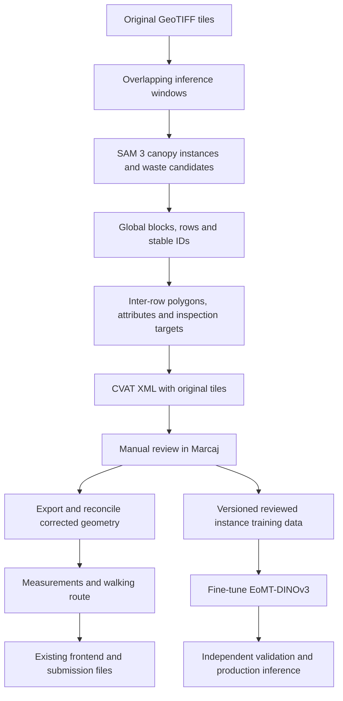

# Vineyard challenge implementation plan

Use SAM 3 to generate pre-annotations, correct them in Marcaj, and train an EoMT model with a DINOv3 backbone on the resulting instance annotations. Combine model predictions with geospatial processing for blocks, rows, inter-row areas, inspection targets, measurements and routing. Connect these outputs to the existing frontend.

The hackathon deadline is Sunday, 27 September 2026 at 15:00 Chișinău time. Complete SAM 3 pre-annotations and the Marcaj workflow independently of student training. If EoMT is not ready, the SAM 3 pipeline remains a reproducible neural-network submission. A student trained after Marcaj publication is evaluated separately and cannot replace the scored annotations through another import.

This is an implementation recommendation based on the supplied rules and published licence terms, not a guarantee of legal clearance. The exact dependency versions and release contents still need to be recorded and checked before distribution. Pinned organizer clarifications in the challenge Slack have not been inspected.

## 1. Selected model and licence approach

Use the official [SAM 3 implementation and checkpoint](https://github.com/facebookresearch/sam3) as the annotation teacher. Test text prompts and automatically generated spatial prompts on the pilot. Record the exact prompts, thresholds and post-processing configuration.

Use [`tue-mps/eomt-dinov3-coco-panoptic-base-640`](https://huggingface.co/tue-mps/eomt-dinov3-coco-panoptic-base-640) as the student starting checkpoint. Adapt it to individual-canopy instance segmentation. It uses a DINOv3 ViT-B/16 backbone, approximately 92 million parameters, and 200 mask queries. Its COCO labels must be replaced with the task's labels.

| Purpose | Starting approach |
|---|---|
| Hackathon canopy pre-annotations | SAM 3 with automatic prompts and row-aware instance separation |
| Dedicated canopy model | EoMT-DINOv3 fine-tuned on reviewed individual-plant masks |
| Submission fallback | SAM 3 plus reproducible spatial processing and Marcaj corrections |
| Waste | SAM 3/classical candidates with Marcaj review; a dedicated trained detector if the pilot supports it |
| Rows, areas, measurements, routing | Geometry processing and optimisation |

A pretrained neural network already satisfies the model component of the brief; training a new network is not mandatory.

### Model licences and distribution

The [SAM 3 licence](https://github.com/facebookresearch/sam3/blob/main/LICENSE) and [DINOv3 licence](https://github.com/facebookresearch/dinov3/blob/main/LICENSE.md) allow use, modification and creation of derivative works subject to their conditions; neither contains a blanket noncommercial-use restriction. Agricultural use is not obviously in conflict with the stated use restrictions. Follow the complete terms, including applicable trade-control and privacy requirements, research acknowledgement and redistribution conditions.

The [EoMT code licence](https://github.com/tue-mps/eomt/blob/master/LICENSE) is MIT. That does not override the DINOv3 backbone's terms. Distribute fine-tuned DINOv3-based weights with the applicable DINOv3 licence and retain EoMT notices; do not describe the entire checkpoint as MIT-only.

SAM-generated masks are outputs, distinct from SAM code or weights. The SAM licence does not expressly prohibit training another model on generated masks, but it does not explicitly settle every legal question about a student trained from them. Do not claim that pseudo-labelling removes all obligations or that Section 5(a) declares every output unrestricted. Record label provenance and resolve the intended release terms before a commercial distribution.

Prefer official acquisition instructions for original checkpoints. Record source revisions, checkpoint URLs and SHA-256 hashes. Downloading separately avoids redistributing the original files yourself; it does not remove use obligations. Hosting trained weights on Hugging Face or cloud storage is still distribution.

For the trained student, provide either the actual checkpoint under applicable terms or a complete training recipe, data/export version and configuration that reproduce it. A link to the original DINOv3 backbone alone does not reproduce the student. Pin the Transformers release or commit used, and test loading, training, saving and reloading before a long run. The original EoMT training code and Hugging Face model use different checkpoint formats; use a supported conversion if switching between them, and check whether an original checkpoint contains delta or absolute weights.

For training data, use the supplied CC BY 4.0 Sireț3 imagery, the team's own annotations, and verified CC BY 4.0 releases of Riseholme and DroneWaste. Retain attribution, source and licence links, and indicate changes to adapted material. CC BY 4.0 permits commercial reuse under its conditions; it does not automatically impose an open-source licence on the application. See [CC BY 4.0](https://creativecommons.org/licenses/by/4.0/).

The supplied route assets include OpenStreetMap-derived data under ODbL. Retain the OpenStreetMap attribution and licence information in the map and data documentation, and meet applicable ODbL requirements when distributing a derived database. Keep data licensing distinct from application-code licensing. See [OpenStreetMap copyright and licence](https://www.openstreetmap.org/copyright).

## 2. Establish whether segmentation works in the first hour

Use the two supplied annotated examples plus a small, varied selection of challenge tiles: young vines, touching canopies, grass, shadows, orchards and tiles without vineyards.

Compare:

- Canopy union IoU.
- Individual-canopy F1 at IoU ≥ 0.5.
- False positives on non-vineyard vegetation.
- Time and peak memory per tile.
- Expected manual correction effort.

Use the supplied examples for initial calibration, without claiming they constitute an independent production test set. Any manual creation or correction of Sireț3 annotations must happen in Marcaj.

Keep native-resolution crops. According to the supplied assets, the challenge tiles are 2048 × 2048 at **2.5 cm/pixel**, rather than the original orthomosaic's 3.52 cm/pixel. Benchmark 640- and 1024-pixel crops for SAM 3. Start EoMT with native-resolution 640 × 640 crops and approximately 128 pixels of overlap at inference. Read each GeoTIFF's actual transform rather than hardcoding resolution.

Do not resize a whole 2048-pixel tile to 640: that shrinks each plant by a factor of 3.2 in each dimension. The student has 200 mask queries, while one example tile has 399 canopies. Count instances per crop and keep below the query capacity; use smaller crops or deliberately retrain the query configuration if necessary. Preserve crop offsets, valid-data masks and coordinate transforms.

Source: [supplied data README](assets_for_participants-20260926T100006Z-1-001/assets_for_participants/README.md).

## 3. Build one geospatial pipeline that owns IDs and geometry



Use Python, Rasterio, Shapely, PyProj, OpenCV/scikit-image and PyTorch. NetworkX and optionally OR-Tools can handle routing. A small FastAPI service can expose the results.

Keep canonical geometry in **EPSG:32635 throughout**. Preserve the inverse pixel/world transforms for Marcaj export and import.

Inventory and hash all 311 supplied TIFFs, checking CRS, dimensions, transforms and nodata. The full source orthomosaic is EPSG:4326; it is an optional training source, not the metric processing reference. Load start and passage/forbidden geometries from the supplied files, not from rounded coordinates copied into code.

Process neighbouring tiles with context; reconcile duplicate predictions before clipping objects back into the supplied tile boundaries. Maintain an internal object registry so clipped fragments retain their physical identity.

## 4. Use vineyard structure to improve segmentation

A mask generator alone can confuse vines, weeds, trees and continuous foliage. Proposed algorithm:

1. Run SAM 3 with candidate vineyard prompts, supported by RGB colour and texture cues.
2. Estimate local row directions and repeated spacing.
3. Fit candidate row axes with robust line fitting; allow piecewise curves.
4. Generate plant prompts along supported rows.
5. Use SAM 3 to refine individual foliage boundaries.
6. Reject candidates inconsistent with vineyard appearance and structure.
7. Split touching canopies at visible narrowings; where necessary, use planting spacing inferred from the same row.

These are hypotheses to validate on the pilot, not guaranteed performance.

Store each instance's mask, score, tile/window provenance, prompt configuration and global coordinates. Retain raw predictions separately from derived geometry. A whole-row mask must be split using image evidence and the annotation conventions before being treated as individual-plant training labels.

Preserve small legitimate plants. Do not apply a blanket minimum-area filter that removes young vines. Regular rows alone do not prove something is a vineyard: orchards also form rows.

For external training, Riseholme is a relevant starting point: 855 images, COCO annotations and multiple seasons. Its Zenodo metadata lists CC BY 4.0. Inspect the masks before mapping its classes to the challenge's individual-plant convention. See the [Riseholme dataset](https://zenodo.org/records/19234907).

## 5. Implement the exact annotation rules as deterministic processing

| Object/property | Implementation rule |
|---|---|
| Blocks | Plantings touching or separated by less than 5 m can belong together; a road or track always separates blocks |
| Rows | One physical row retains one globally unique ID across tiles; gaps do not split it |
| Row structure | `disrupted` for a visible gap ≥ 5 m or an obstacle in the row; classify per tile |
| Inter-row boundaries | Between canopy edges, ending at the shorter adjacent row; exclude headlands, roads and obstacles |
| Inter-row cover | Approximately <25% vegetation → `bare_soil`; 25–75% → `mixed`; >75% → `vegetation` |
| Unassessable | Use when the relevant feature cannot be interpreted from the imagery |
| Waste association | Block containing the waste, or nearest block within 10 m; otherwise leave `vineyard_id` empty |

Source: [supplied annotation rules](assets_for_participants-20260926T100006Z-1-001/assets_for_participants/03_docs/Vineyard_AI_annotation_rules.pdf).

Construct inter-row polygons from adjacent row-facing canopy boundaries. Subtracting canopies from an entire block is insufficient: that also includes exterior margins and other ground that is not inter-row area.

Store tile-level attributes separately from global row identity. The same row can legitimately be regular in one tile and disrupted in another.

## 6. Treat waste and inspection targets separately

For the first complete pipeline, test SAM 3 prompts for visible litter alongside colour, texture and object-shape proposals. Convert supported instances into tight axis-aligned bounding boxes, suppress repetitive planting infrastructure, and review the boxes in Marcaj. Individually distinguishable items remain separate; an inseparable cluster is one object. Measure waste precision and recall rather than claiming the proposal method is production-ready.

Train a separate waste detector if a timed pilot supports doing so before publication; map categories to the challenge's single `waste` label. DroneWaste is available under CC BY 4.0, but its landfill imagery will differ from scattered vineyard litter. Validate that transfer rather than assuming it works. See the [dataset authors' description](https://aura-lab.org/datasets/) and [dataset download](https://zenodo.org/records/17045558).

Keep the first EoMT experiment canopy-only so rare waste instances do not complicate its validation. A later model can include waste as a separate instance class if reliable masks are available; bounding-box annotations alone must not be treated as true segmentation masks. A separate box detector is also compatible with the pipeline, with its own code and weight licences recorded.

White vine tubes, stakes, irrigation equipment and pale soil are important negative examples. Review ambiguous detections in Marcaj.

Derive inspection candidates from missing canopy intervals along established rows. Store:

```text
inspection_id, vineyard_id, row_id, x, y,
reason, confidence, gap_length_m
```

Label these as potential missing planting, since shadows and missed detections can also produce apparent gaps. Inspection targets belong in application outputs, not as additional Marcaj labels.

## 7. Give routing as much attention as canopy segmentation

The scoring PDF assigns **25% to canopies and 25% to routing**. Route efficiency earns points only from 90% reference-target coverage, and targets are hidden. More than 2% of route length outside passable areas makes the routing score zero.

Source: [challenge scoring, pages 4–5](assets_for_participants-20260926T100006Z-1-001/assets_for_participants/03_docs/Vineyard_AI_Field_Challenge_description.pdf).

Build the walking network from:

```text
inter-row areas ∪ authorised passages
− canopies − forbidden zones − known barriers
```

Use corridor centre lines or a walkability grid, with all connections checked against the actual geometry. Vine-row axes are measurement features, not walking paths.

Then:

1. Connect the supplied start through a valid passage.
2. Find reachable approach locations for targets.
3. Compute shortest-path distances through the walking network.
4. Optimise a closed tour using those distances.
5. Expand the tour back into the real paths.
6. Report unreachable targets explicitly.
7. Validate the entire final polyline, including any smoothing.

A target counts as visited for scoring when the route passes within **2 m**. Do not silently snap an inaccessible target somewhere else; record the approach distance and accessibility.

Implement two useful modes: a targeted visit route and an inspection sweep of relevant inter-rows. The sweep provides coverage where detection is uncertain. Compare their lengths and coverage of reviewed targets; hidden-reference coverage remains unknown.

## 8. Make Marcaj the central deadline milestone

The sequence is:

**Complete full-area predictions → reconcile IDs → package all tiles → upload → verify 311 files → publish → manually correct → submit every job.**

Build and validate the CVAT converter early using the supplied example ZIP. XML coordinates must be in tile pixels; submission GeoJSON coordinates must be in UTM metres.

Upload the original TIFFs unchanged with their original names, in CVAT for images 1.1 ZIPs below the platform's 90 MB limit. Check every import report, the exact labels and attribute values, and the total of 311 files before publishing. Do not add, delete or rename tiles or change label settings after publication. The supplied guide describes 63 jobs; every job must be submitted, including explicit no-object answers for empty frames.

All manual Sireț3 annotation work stays in Marcaj, including hand-placed prompts intended to create object geometry, hand-drawn training masks and manual attribute corrections. Automated prompts and reproducible model/post-processing changes are permitted. After publication, corrections to the scored annotations are manual in Marcaj; local training does not authorise replacing those annotations with new predictions. Use only the team's own annotations and allowed external data, never another team's annotations.

Assign neighbouring tiles to the same reviewer. Prioritise:

1. Incorrect vineyard detections and missed blocks.
2. Row IDs and continuity across tile boundaries.
3. Merged or missed canopy instances.
4. Waste false positives and attribute errors.
5. Empty-frame confirmation and job submission.

Once published, another model pass cannot be imported. Do not delay this review window while waiting for a student model to train.

Before publication, a student trained on automated labels or allowed external data may generate the pre-annotations if it wins the pilot and finishes in time. After publication, use Marcaj exports to train the reviewed-label student, while the scored project continues to receive manual corrections only. This removes the circular dependency of waiting for corrected labels before the initial upload.

Export the corrected annotations before submission, then regenerate measurements and routes from that version so the web interface and Marcaj agree.

## 9. Connect the existing frontend through a small, stable contract

Serve blocks, canopies, rows, inter-rows, waste, inspection targets, routes and measurement summaries. Keep expensive processing offline or in a background job; the interface reads prepared results.

Supply a separate longitude/latitude representation for a conventional web map while retaining EPSG:32635 for measurements and required downloads.

Calculate:

- Unique block and row counts.
- Deduplicated row lengths.
- Canopy area from polygon unions.
- Inter-row area without canopy overlap.
- Hectares as square metres divided by 10,000.
- Route length from its final projected geometry.

Never report waste bounding-box area as waste surface area.

Give each result set a run/version ID and annotation-export hash. Keep reviewed submission results and student predictions identifiable in the API and interface. The final route and measurement tables must correspond to the reviewed submission snapshot. The existing frontend is a display and inspection interface; it must not become an alternative Sireț3 annotation editor.

## 10. Delivery schedule

Assuming one usable GPU and several teammates, these are planning targets, not measured runtimes:

| Window | Deliverable |
|---|---|
| First hour | SAM 3 pilot, EoMT load/train/save smoke check, processing-time estimate |
| Next few hours | Full pipeline, global IDs, valid CVAT packages; routing developed alongside it |
| Saturday evening, 26 September | All 311 files uploaded and published; review underway; train the student on available reviewed exports |
| Sunday morning, 27 September | Corrected annotations exported; student evaluated separately; final measurements, routing and frontend integration |
| Sunday by 13:00 | Submission candidate frozen; reproducibility run and demo rehearsal |
| Sunday before 15:00 | Every Marcaj job submitted; repository and interface verified |

Divide ownership between modelling, geometry/Marcaj conversion, routing, and frontend integration. Everyone can help review after publishing.

Before release, automatically check that the route is one closed `LineString`, starts at the supplied point, stays inside permitted geometry, and reports its computed length. Also check unique IDs, valid polygons, canopy/inter-row non-overlap and complete tile coverage.

## 11. EoMT-DINOv3 training and production validation

### Dataset preparation

1. Export the team's Marcaj annotations and record the export hash and review status.
2. Convert canopy polygons into COCO instance annotations or the equivalent per-instance mask/class tensors. Each plant is a separate instance of `vineyard`; block IDs and row IDs are metadata, not model classes.
3. Split into spatially separated train, validation and test regions before cropping. Overlapping windows and neighbouring views of the same plant stay in one split. For production evaluation, hold out entire vineyards/acquisition dates.
4. Generate 640 × 640 training crops with their clipped instance masks. Preserve small and edge-cut plants and exclude nodata from learning as appropriate.
5. Include verified negative crops with grass, orchards, trees, roads and bare soil.
6. Use reviewed labels preferentially. If retaining unreviewed pseudo-labels, track them separately and lower their training weight. Missing or rejected teacher masks do not prove background: exclude uncertain crops or implement explicit loss masking for uncertain regions rather than silently training false negatives.

Use the organizer's two examples for initial calibration only. Once used to choose settings, do not present them as an independent final test set. External Riseholme data require checking class/instance conventions and scale before mixing with Sireț3.

### Fine-tuning recipe

- Initialise from the specified EoMT-DINOv3 checkpoint, replace the COCO class head with one foreground class, and retain the implementation's no-object handling.
- Train with one binary mask and one class ID per plant using the model's matching, classification and mask losses. Use instance post-processing; do not fuse all `vineyard` predictions as a single stuff region.
- First overfit 10–20 reviewed crops to verify image/mask alignment, class mapping, empty-image handling and loss behaviour.
- Use mixed precision where supported and choose batch size from a measured memory test. Gradient accumulation can increase effective batch size.
- Start with AdamW, a smaller learning rate for the pretrained backbone than the new head, and modest geometric/colour augmentation. Select actual learning rates and training duration using a short pilot rather than claiming an unmeasured fixed schedule.
- Preserve nearest-neighbour interpolation for masks and consistent transforms for images and labels. Avoid resizing that removes small vines.
- Save the best checkpoint by reviewed validation metrics, with seeds, exact software versions, training configuration and data hashes.
- Reload the saved checkpoint in a fresh process and verify that it reproduces the validation predictions.

Training references: [official EoMT fine-tuning instructions](https://github.com/tue-mps/eomt#training), [Transformers EoMT-DINOv3 documentation](https://huggingface.co/docs/transformers/model_doc/eomt_dinov3), [checkpoint configuration](https://huggingface.co/tue-mps/eomt-dinov3-coco-panoptic-base-640/blob/main/config.json).

### Evaluation and deployment gate

Compare SAM 3 and the student against the same human-reviewed validation set, not merely against each other's predictions. Report canopy union IoU, instance F1 at IoU ≥ 0.5, count error, false positives on negative tiles, area error, runtime and peak memory. Inspect small vines, touching canopies, shadows and crop-edge duplicates separately.

Promote the student only if it meets a recorded quality threshold and provides a measured operational benefit. Use tiled inference, geospatial duplicate reconciliation and the same downstream geometry pipeline. Keep the teacher as a benchmark and fallback while evaluating unseen vineyards and dates. Do not claim production readiness from one orthomosaic or from agreement with SAM labels alone.

Keep separate records for dataset licences, SAM output provenance, EoMT code and DINOv3 checkpoint terms. Resolve the final distribution package and notices before shipping trained weights commercially.

The production milestone should be measured accuracy on unseen vineyards, predictable processing cost, and a review workflow for uncertainty. The hackathon pipeline can provide the first version of all three without making a rushed training run determine whether the submission is finished.

## 12. Release records and submission checks

- `THIRD_PARTY_NOTICES.md`: exact component names, versions, upstream sources, licence texts/references and required notices, including model weights.
- Copies of the SAM and DINOv3 licences and the EoMT MIT notice, clearly scoped to the relevant components. The application's own licence must not purport to replace third-party terms.
- `DATA_SOURCES.md`: imagery and training-data releases, author attribution, licence links and transformations; include 3DATA COLLECT / OpenAerialMap and OpenStreetMap as applicable.
- Model manifest: exact teacher/student checkpoint hashes, training-data/export versions, prompts, configuration and reproducible acquisition or training instructions. Access steps for gated official downloads must be documented without committing credentials.
- README: pinned dependencies, execution steps, measured full-set processing time and hardware, working interface link, and paid APIs or LLMs actually used, including development assistance where applicable.
- Root submission files: `route.geojson` as one closed EPSG:32635 LineString with `length_m`, and `measurements.csv` based on the reviewed annotations.
- Route checks: exact supplied start/end where feasible (within 5 m required), reachable-target coverage within 2 m, valid continuous geometry, and a target of zero length outside passable areas. Report unreachable targets and do not claim measured coverage of the hidden reference targets.
- Marcaj: published project, all supplied files preserved, every job submitted before 15:00 on 27 September 2026.
- Check the organizer's pinned challenge clarifications before publishing; these were not available in the local assets reviewed for this plan.
